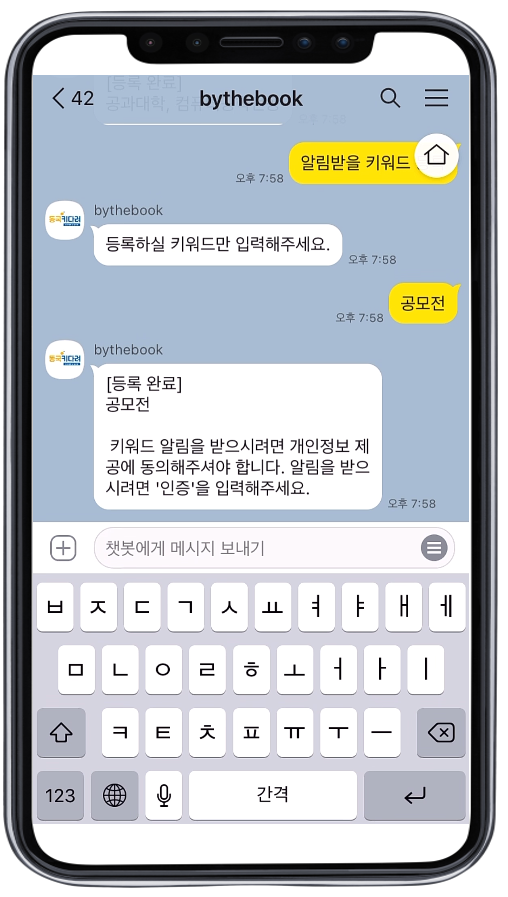
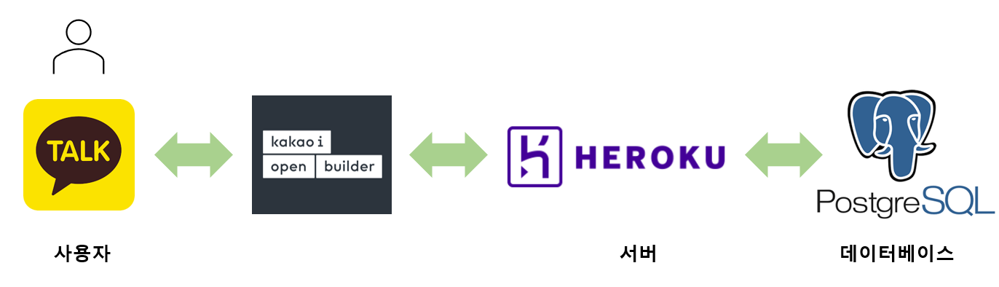

# 키워드 자동 알림 서비스, 동국Key다려

## 프로젝트 개요

### 문제 정의

동국대학교 홈페이지에서 원하는 정보를 찾는 과정이 매우 번거롭다. 각종 기사들과 모든 학과들의 정보가 뒤섞여 원하는 정보를 찾기까지 꽤많은 시간을 투자해야한다. 또한 언제 올라올지 모르는 공지를 얻기 위해, 학교 홈페이지, 단과대 홈페이지, 학과 홈페이지를 수시로 드나들어야 하는 수고스러움이 있다.

### 프로젝트 목표

원하는 정보를 찾기 위해, 학교 홈페이지의 여러 게시판을 드나드는 수고스러움을 없애고, 언제 올라올지 모르는 공지를 수시로 확인하는 시간적 비효율성을 줄인다.

## 프로젝트 소개

#### 키워드를 등록하고 기다리면 알림을 드려요 :)

### 처리 흐름도

### 주요 기능

|                                              |                                              |                                                    |                                        |                                                  |                                            |
| :------------------------------------------: | :------------------------------------------: | :------------------------------------------------: | :------------------------------------: | :----------------------------------------------: | :----------------------------------------: |
|  |  |  |  |  |  |
|                 키워드 등록                  |                 키워드 삭제                  |                 등록한 키워드 확인                 |              사용자 인증               |                 사용자 정보 등록                 |                 공지 알람                  |

아래 시연영상에서 더 자세한 기능을 확인하실 수 있습니다.

### 시연영상

[시연영상1](https://youtu.be/qFQY1amIqKU) 
[시연영상2](https://youtu.be/L9I33gFD4GA)

## 기술 스택

### 개발환경

- Framework : Flask
- Language : Python 3.12
- Database : postgrsql
- Server : heroku
- Chatbot : kakao

### 시스템 구성도

## 팀원

#### 뿌셔뿌셔 팀

|                  팀원                  |    학번    |
| :------------------------------------: | :--------: |
| [길가은](https://github.com/rlfrkdms1) | 2019110387 |
| [백지원](https://github.com/wonny7447) | 2019113184 |
|  [손민호](https://github.com/Hoyasdf)  | 2019112051 |
| [이소정](https://github.com/SJLEE316)  | 2018113429 |
