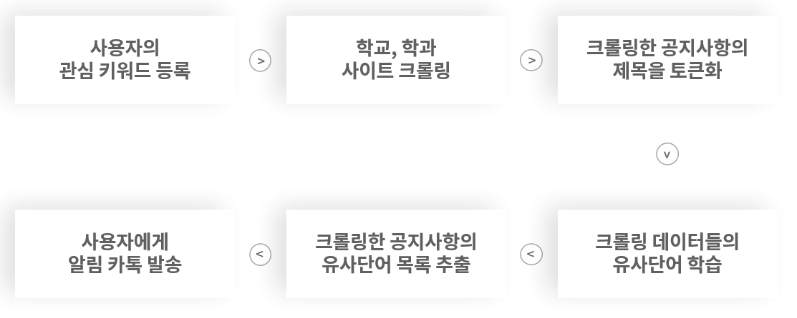
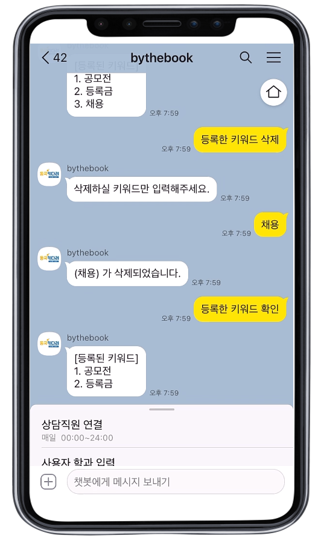
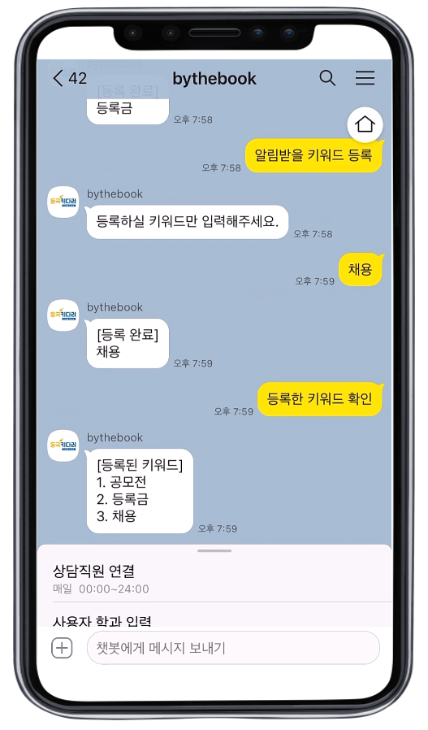
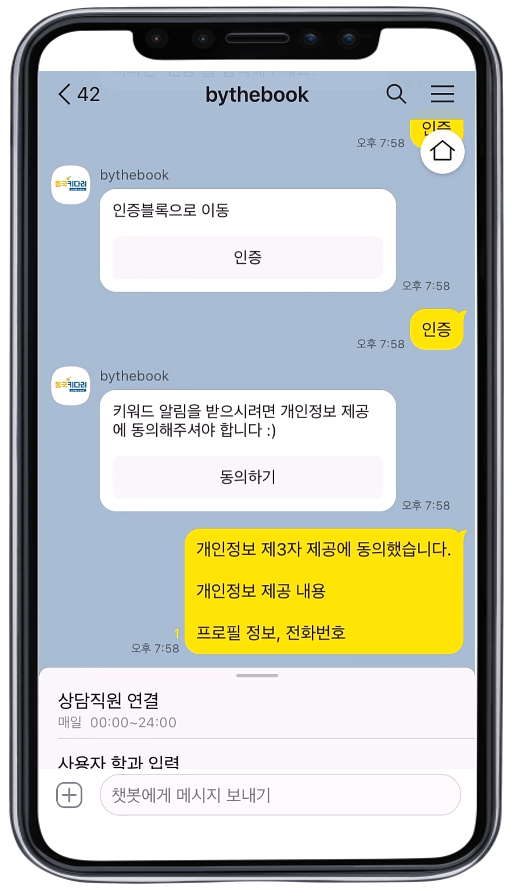
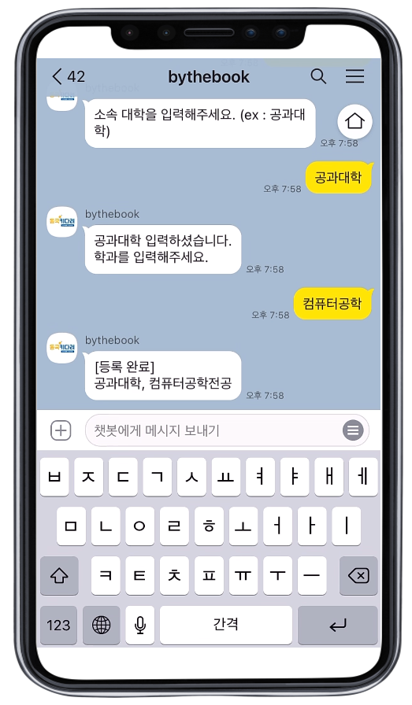
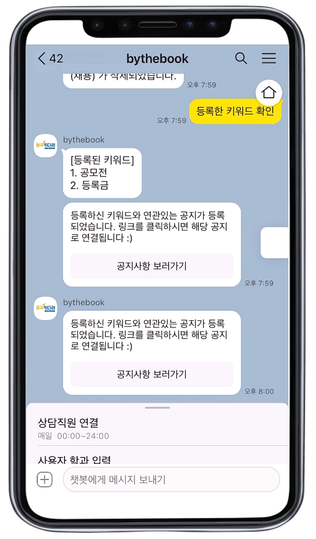
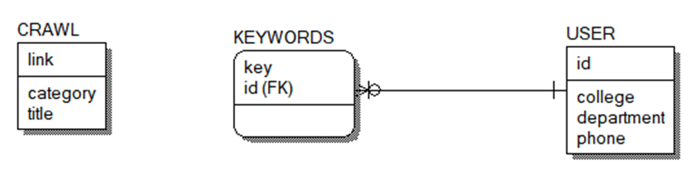

# 키워드 자동 알림 서비스, 동국Key다려

## 프로젝트 개요

### 문제 정의

동국대학교 홈페이지에서 원하는 정보를 찾는 과정이 매우 번거롭다. 각종 기사들과 모든 학과들의 정보가 뒤섞여 원하는 정보를 찾기까지 꽤많은 시간을 투자해야한다. 또한 언제 올라올지 모르는 공지를 얻기 위해, 학교 홈페이지, 단과대 홈페이지, 학과 홈페이지를 수시로 드나들어야 하는 수고스러움이 있다.

### 프로젝트 목표

원하는 정보를 찾기 위해, 학교 홈페이지의 여러 게시판을 드나드는 수고스러움을 없애고, 언제 올라올지 모르는 공지를 수시로 확인하는 시간적 비효율성을 줄인다.

## 프로젝트 소개

#### 키워드를 등록하고 기다리면 알림을 드려요 :)

사용자가 관심있는 키워드를 챗봇에 등록한다. 서버에서는 1시간마다 크롤링을 하여, 새로운 공지글이 올라오면 제목을 토큰화와 유사단어 처리를 하고, 유사단어를 키워드로 등록한 사용자에게 링크를 발송한다. 예를 들어, 사용자가 '등록금'이라는 키워드를 등록하였지만, '수강료 납부'라는 게시글이 올라올 경우, '수강료'와 '납부'로 토큰화가 진행되고, 이 단어에 대한 유사단어 처리를 한다면, '납부'와 '등록금'이 유사단어로 모델링이 된다. 따라서 '등록금'을 키워드로 등록한 사용자는 '수강료 납부'라는 공지글을 안내받을 수 있다.
또한 '컴퓨터공학과'학생은 다른 학과의 공지글을 안내받을 필요가 없다. 키워드를 등록하기 전에, 사용자 정보(단과대학, 학과)를 입력받으면, 공통된 게시판(일반공지, 학사공지, 장학공지 등)과 사용자의 단과대학 또는 학과에 올라오는 공지글만 받을 수 있다.

### 처리 흐름도

### 주요 기능

|                                              |                                                  |                                                    |
| :------------------------------------------: | :----------------------------------------------: | :------------------------------------------------: |
|  |      |  |
|                 키워드 등록                  |                   키워드 삭제                    |                 등록한 키워드 확인                 |
|        |  |          |
|                 사용자 인증                  |                 사용자 정보 등록                 |                     공지 알람                      |

아래 시연영상에서 더 자세한 기능을 확인하실 수 있습니다.

### 시연영상

링크를 누르시면 유튜브로 연결됩니다. 
[시연영상1](https://youtu.be/qFQY1amIqKU) 
[시연영상2](https://youtu.be/L9I33gFD4GA)

## 기술 스택

### 개발환경

- Framework : Flask 0.12.1
- Language : Python 3.8.12
- Database : postgresql
- Server : heroku
- Chatbot : kakao

### 사용한 오픈소스

- Selenium 4.0.0
- Beautifulsoup4 4.6.0
- KoNLPY 0.5.2
- gensim 3.8.1

### 시스템 구성도

### DB 구조

## 팀원

#### 뿌셔뿌셔 팀

|                  팀원                  |    학번    |
| :------------------------------------: | :--------: |
| [길가은](https://github.com/rlfrkdms1) | 2019110387 |
| [백지원](https://github.com/wonny7447) | 2019113184 |
|  [손민호](https://github.com/Hoyasdf)  | 2019112051 |
| [이소정](https://github.com/SJLEE316)  | 2018113429 |
